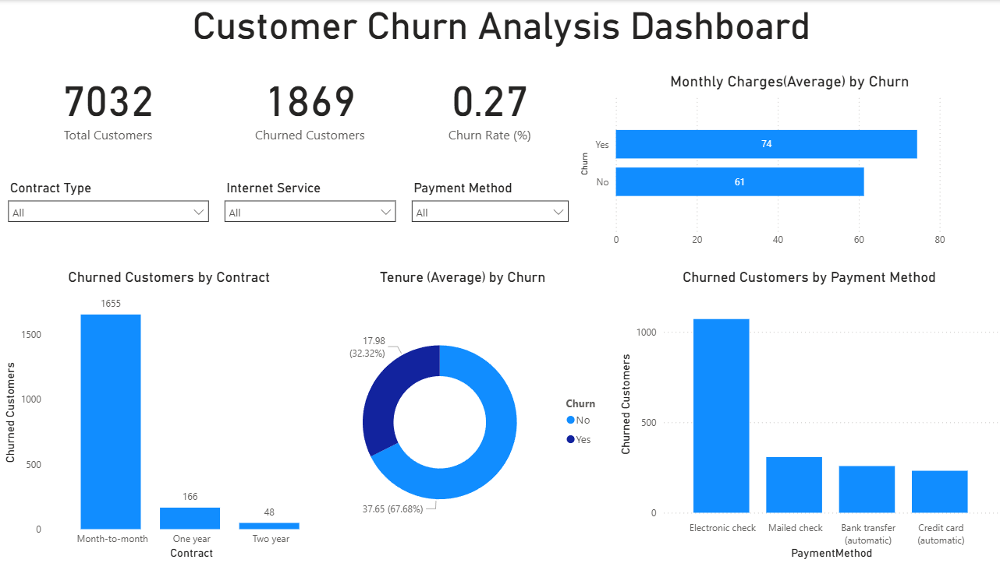

# 📊 End-to-End Customer Churn Analysis Capstone Project

## 🔍 Project Overview
This capstone project analyzes customer churn for a telecom company using SQL, Python, and Power BI.
The objective is to identify churn patterns, understand key drivers, and provide actionable business insights.

---

## 🧠 Business Problem
Customer churn directly impacts revenue and growth.
This project aims to:
- Identify customers likely to churn
- Understand factors contributing to churn
- Help the business take proactive retention measures

---

## 🛠 Tools & Technologies
- SQL (PostgreSQL)
- Python (Pandas, Matplotlib, Seaborn, Scikit-learn)
- Power BI
- GitHub

---

## 📂 Project Structure
ecommerce-churn-capstone/
│
├── data/
│ └── telco_churn.csv
│
├── sql/
│ └── churn_analysis.sql
│
├── python/
│ └── churn_analysis.ipynb
│
├── powerbi/
│ └── churn_dashboard.pbix
│
├── screenshots/
│ └── dashboard.png
│
└── README.md

---

## 📊 Key Analysis (SQL)
- Overall churn rate
- Churn by contract type
- Churn by payment method
- Churn vs tenure
- Churn vs monthly charges

---

## 🤖 Machine Learning Models
- Logistic Regression
- Decision Tree Classifier

**Best Accuracy:** ~79%  
Decision Tree provided better recall for churned customers.

---

## 📈 Power BI Dashboard
The dashboard provides:
- Overall churn KPIs
- Churn breakdown by contract, tenure, and payment method
- Interactive filters for business exploration

📸 Dashboard Preview:

---

## 💡 Key Business Insights
- Month-to-month contracts have the highest churn
- Customers with higher monthly charges churn more
- Long-term contracts significantly reduce churn
- New customers are more likely to churn

---

## 🚀 Recommendations
- Promote long-term contracts with incentives
- Offer retention discounts to high-risk customers
- Improve onboarding experience for new customers

---

## 🔮 Future Improvements
- Apply ensemble models (Random Forest, XGBoost)
- Address class imbalance using SMOTE
- Add customer lifetime value analysis
